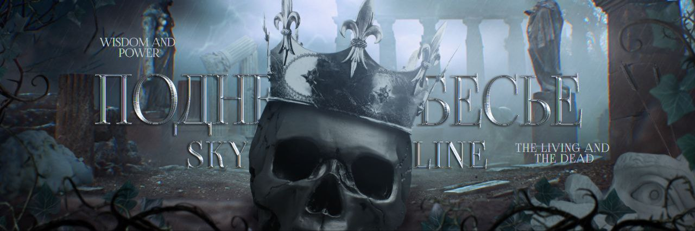
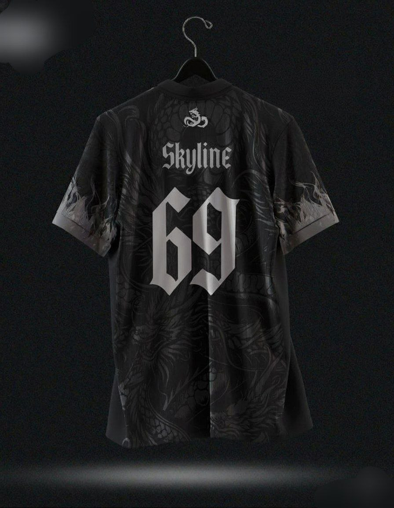

<!DOCTYPE html>
<html lang="en">
<head>
  <meta charset="UTF-8">
  <title>SKYLINE FAMILY</title>
  
</head>

<body>
  <header>SKYLINE FAMILY</header>

  <nav>
    <a href="#" onclick="showSection('main')">Our team</a>
    <a href="#" onclick="showSection('main')">Administration</a>
    <a href="#" onclick="showSection('merch')">Merch</a>
  </nav>

  

    
    
NEW

  

  

    

      <h3>Chat Selector</h3>
      

        <button onclick="showChat('chat1')">CHAT 1</button>
        <button onclick="showChat('chat2')">CHAT 2</button>
        <button onclick="showChat('chat3')">CHAT 3</button>
      

      

        <h4>CHAT 1: Cozy Vibes</h4>
        
Добро пожаловать в уютный чат. Здесь царит спокойствие и ламповая атмосфера.

        <audio controls>
          <source src="Forg Chat 1.mp3" type="audio/mpeg">
        </audio>
      

      

        <h4>CHAT 2: Urban Pulse</h4>
        
Городская эстетика, ритмы мегаполиса и динамичные разговоры.

        <audio controls>
          <source src="Away Chat 2.m4a" type="audio/mpeg">
        </audio>
      

      

        <h4>CHAT 3: Dreamspace</h4>
        
Место для мечтателей, вдохновения и креативных идей.

        <audio controls>
          <source src="First Chat 3.mp3" type="audio/mpeg">
        </audio>
      

    

    

      <h3>Opening Date</h3>
      
<strong>12 November 2023</strong>

      
Our new website is finally live! Explore the new features and design.

      <h3>Dream Team Project</h3>
      <ul>
        <li>Vibe</li>
        <li>Teamwork</li>
        <li>Illustration</li>
      </ul>

      <button class="info-button" onclick="openPopup()">Подробнее о нас</button>
    

    

      <h3>MEM ZONE</h3>
      

        

          
          
Когда подумал о своей жизни

        

      

      

        <h4>Добавь свой мем</h4>
        <input type="text" id="memeUrl" placeholder="Ссылка на изображение" style="width:100%; padding:8px; margin-bottom:10px; box-sizing: border-box;">
        <input type="text" id="memeText" placeholder="Подпись к мему" style="width:100%; padding:8px; margin-bottom:10px; box-sizing: border-box;">
        <button onclick="addMeme()" style="padding:10px 20px; background:#314047; color:white; border:none; border-radius:6px; cursor:pointer;">Добавить</button>
      

    

    

      <h3>Mood Generator</h3>
      

        <button class="mood-btn" onclick="generateMood()">Сгенерировать Настроение</button>
        

          
          
Нажмите, чтобы увидеть ваше настроение!

          <audio controls id="moodAudio" style="display:none;"></audio>
        

      

    

  

  

      <h2>SKYLINE FAMILY MERCH</h2>
      
Поддержите проект и получите эксклюзивные вещи! ✨

      
      
      
      
СКОРО В ПРОДАЖЕ!

      <button onclick="showSection('main')" class="info-button" style="width: 50%; max-width: 300px; margin: 20px auto 0;">Вернуться на главную</button>
  

  

    <a href="https://t.me/SkylineProject" target="_blank" onmouseover="this.style.backgroundColor='#8f9aa0'" onmouseout="this.style.backgroundColor='#55788a'">
      Перейти в Telegram-канал c вашим вайбом 🚀
    </a>
  

  <footer>
    SKYLINE FAMILY © 2025 | Privacy Policy
  </footer>

  

  

    <h3>Информация о проекте</h3>
    
Добро пожаловать в DREAM TEAM PROJECT! Это творческий проект, где мы делимся эстетикой наших чатов, музыкой и вдохновением.

    <button class="close-btn" onclick="closePopup()">Закрыть</button>
  

  

</body>
</html>
